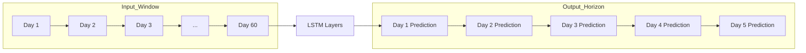

### 1) Create and activate virtual environment
Python 3.12 (issues on 3.13)
### 2) TensorFlow z GPU (Metal)
pip install --upgrade pip

pip install tensorflow-macos

pip install tensorflow-metal  # turn on GPU through Metal

### 3) PyTorch z MPS (GPU Apple)

pip install torch torchvision torchaudio

### Hardware Requirements

When working with this LSTM model for time series forecasting, it is important to consider the RAM requirements for both training and inference phases. Training generally requires significantly more memory due to the need to store gradients and optimizer states, while inference is less demanding.

| Scenario  | RAM Requirements                                |
|-----------|------------------------------------------------|
| Training  | Minimum 8 GB, recommended 16 GB, 32 GB+ for large datasets/models |
| Inference | 4–8 GB typically sufficient, 16 GB for comfortable usage with headroom |

**Note:** On Apple Silicon devices, unified memory architecture allows the CPU and GPU to share the same memory pool, improving efficiency. However, training requires more RAM because it must hold not only the model parameters but also intermediate states such as gradients and optimizer information, whereas inference only needs to load the model and perform forward passes.

### Program Description

This program is designed to perform time series forecasting using an LSTM (Long Short-Term Memory) neural network model. The model takes as input a sliding window of 60 days of sequential data and predicts the next 5 days ahead. This approach is useful for forecasting tasks where understanding temporal dependencies in data is crucial.

### How it works

- **Input:** A sequence of 60 days of historical data points.
- **Model:** The LSTM network processes this sequence to learn temporal patterns and dependencies.
- **Output:** The model predicts the values for the next 5 days (the forecast horizon).

### Parameters

- **Input window size:** 60 days (length of the input sequence).
- **Output horizon:** 5 days (number of days to predict ahead).
- **LSTM layers:** The network contains one or more LSTM layers that capture sequential dependencies.
- **Training:** The model is trained on historical data to minimize prediction error.

### What is LSTM?

LSTM is a type of recurrent neural network (RNN) architecture specifically designed to handle long-term dependencies in sequential data. Unlike traditional RNNs, LSTMs can effectively remember information over long sequences by using gated cells that regulate the flow of information. This makes them particularly well-suited for time series forecasting tasks.



### Example Requests

You can test the FastAPI server using `curl` commands as follows:

1. **Health check**

```bash
curl http://127.0.0.1:8000/healthz
```

Sample JSON response:

```json
{
  "status": "ok"
}
```

2. **Prediction request**

```bash
curl -X POST http://127.0.0.1:8000/predict -H 'Content-Type: application/json' -d '{"ticker":"AAPL","steps":5}'
```

Sample JSON response:

```json
{
  "ticker": "AAPL",
  "forecast": [150.23, 151.45, 152.10, 153.00, 154.25]
}
```

### Makefile
```text
# Usage examples:
make venv            # create virtualenv (.venv)
make install         # install dependencies from requirements.txt
make train           # train models for all tickers (writes to models/)
make serve           # run FastAPI server on http://127.0.0.1:8000
make dev             # run FastAPI with --reload
make health          # curl /healthz (pretty-printed if jq installed)
make predict TICKER=AAPL STEPS=5   # sample forecast call
```